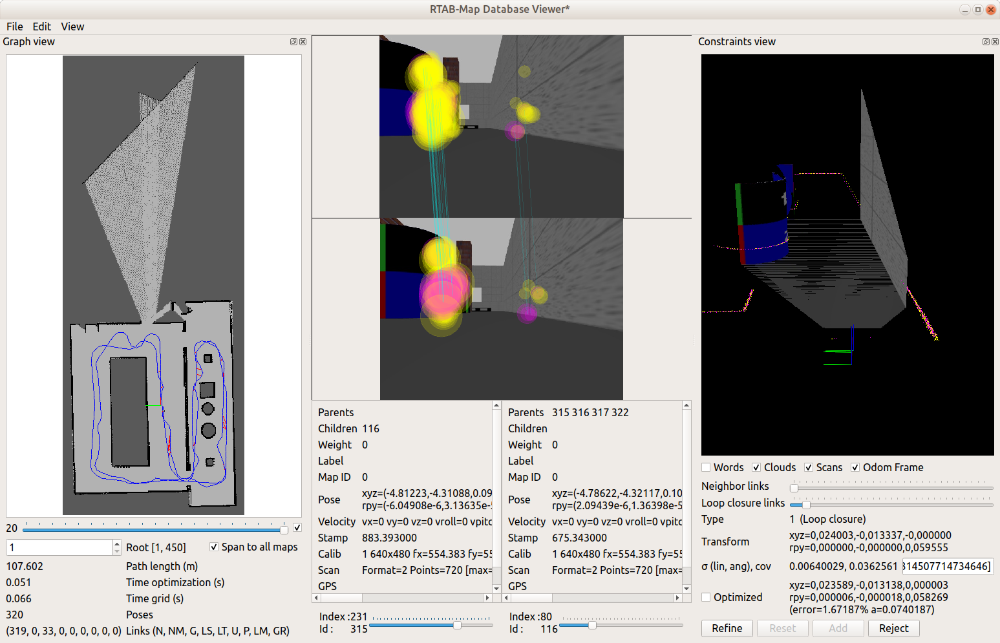
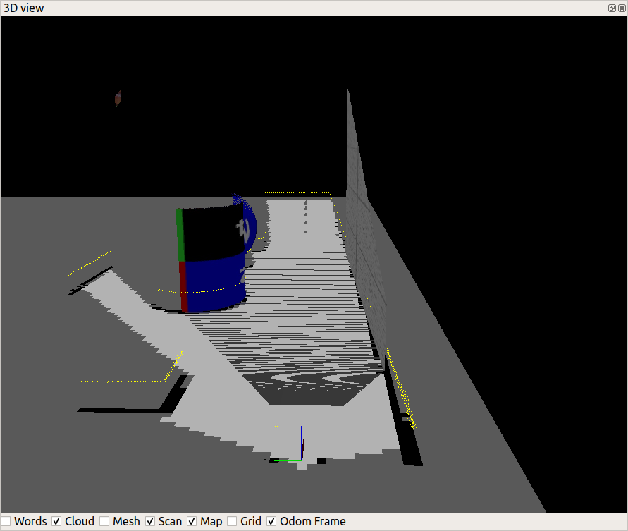
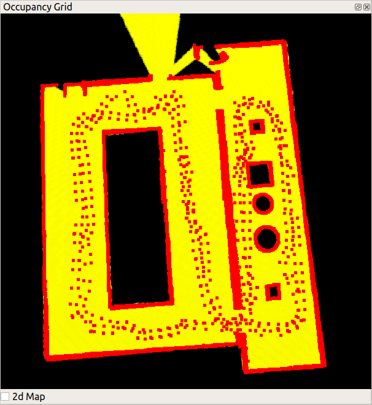

# Map My World
**Experiments with Graph-SLAM and its RTAB-Map implementation in a Gazebo simulation.**
 
## Dependencies
The following needs to be installed:
- ROS Melodic or Kinetic and the corresponding Gazebo version;
- cmake 2.8.3 or later and gcc 7.5 or later.

The repository is a Catkin workspace, and includes the [rtabmap_ros](http://wiki.ros.org/rtabmap_ros) package, which in turn has several dependencies; the easiest way to install them is with:

```shell script
sudo apt-get install ros-<distribution>-rtabmap ros-<distribution>-rtabmap-ros
sudo apt-get remove ros-<distribution>-rtabmap ros-<distribution>-rtabmap-ros
```

where `<distribution>` is either `melodic` or `kinetic`.

Tested under Ubuntu 18.04 (ROS Melodic) and Ubuntu 16.04 (ROS Kinetic).
 
 ## Installation
Clone the GitHub repository:
```shell script
git clone https://github.com/fantauzzi/map_my_world.git
```


**Outside your Catkin workspace**, install RTAB-MAP standalone lilbraries. Add `-DCMAKE_INSTALL_PREFIX=<path to catkin ws>/devel` to the `cmake` command below if you want to install in the Catkin's devel folder (without `sudo`). Replace `<path to catkin ws>` with the path to the cloned repository (which is a catkin workspace).

```shell script
git clone https://github.com/introlab/rtabmap.git rtabmap
cd rtabmap/build
cmake ..
make
sudo make install
```

Now you are all set to build the project (which includes the `rtabmap_ros` package). Back in the root of the cloned repository:

```shell script
catkin_make
```

It will build the project.

## Running it

In the root of the cloned repository run:
```shell script
source devel/setup.bash
roslaunch my_robot world.launch 
```
Gazebo and RViz will start, showing the environment and placing a blue robot in it.

To drive the robot around, run, again in the same directory:
```shell script
source devel/setup.bash
rosrun teleop_twist_keyboard teleop_twist_keyboard.py
```

The keyboard teleop node will start. The robot is non-holonomic (it has a differential drive). For the keyboard teleoperation to work, make sure you have its window/shell selected before typing.
  
In another shell, in the same directory, run:
```shell script
source devel/setup.bash
roslaunch my_robot mapping.launch 
```

It will start RTAB-MAP, and begin building the map. The resulting database file is saved at the default location, `~/.ros/rtabmap.db`, overwriting any database previously saved there.

To use a map already built for localization, instead of `mapping.launch` run:

```shell script
source devel/setup.bash
roslaunch my_robot localization.launch 
```

## Screenshots

The RTAB-Map database Viewer showing a loop closure link.


The 3D view of the loop closure link.


The generated occupancy grid.


## Credits

The [rtabmap_ros](https://github.com/introlab/rtabmap_ros) package, included in the project. 

The keyboard teleop [package documentation](http://wiki.ros.org/teleop_twist_keyboard).

The `training_world.pgm` map has been generated from the Gazebo world using [pgm_map_creator](https://github.com/udacity/pgm_map_creator). The package itself is not included in this repository as it is not available for (and doesn't build under) Melodic.

Templates for configuration files made available by Udacity as part of their Robotics Software Engineer Nanodegree Program.